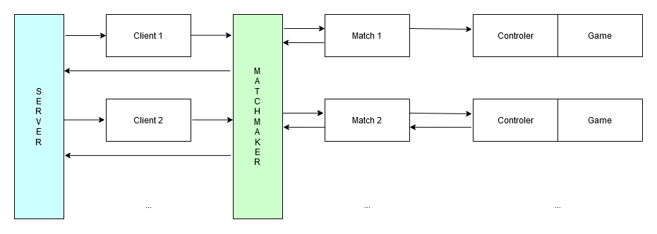
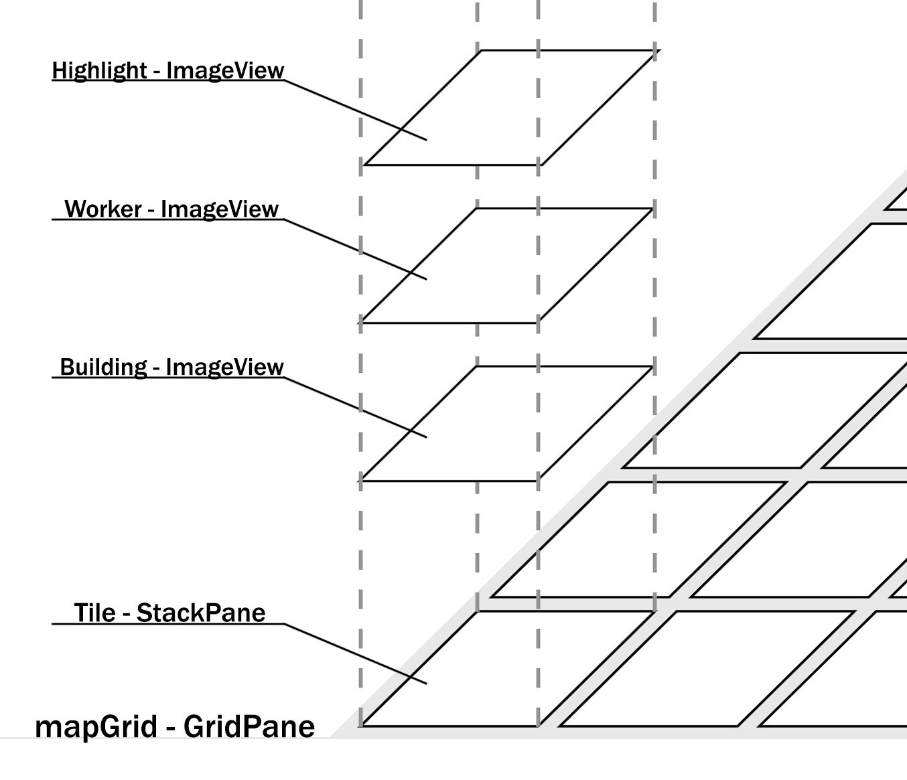

# Application Design

This document explains the main design decision we made in our project.

## Unusual MVC

In out project we decided to use a strict version of MVC like the on proposed by Apple.


Our model communicates only with the controller, there is no direct interaction with the view.

We also decided to use a synchronous model without callbacks because they make code less readable and break the normal flow of execution.
A few callbacks are fine and not that bad, for example we use 3 callback from the network layer to the controller/view.
But with the game (our sole model interface) we would have a huge amount of callbacks hard to debug and understand.

Another strong point of not using callback is that in case of error recovery is super simple!
If we were used a callback and receive a broken message who should handle the error?
The controller that has no knowledge of the model? The model itself? The callback? 
The best way in this case would be calling a different callback breaking the whole execution flow making the code hard to understand.

In our design we don't have this problem. The controller just recalculate the current "broken" move when `Game` returns an error!
This behaviour can be imagined as: "Controller try to run an action. If fail he can request again the action, otherwise it can calculate the next step of the match".
We traded the "controller knows nothing abound the model" to a half-way design. The controller knows just how game behave externally. 
Our model exposes the bare minimum getters to let the user (our controller) to know what game is doing and what to do to continue the match!

Please notice that it seems that our interface leaks `Game` internal implementation but is not, with the interface only common types are passed, no internal data is exposed!
Using `Game` public interface is like asking two people "how is going the match?". They both now about the map, the current player, ecc.

## Server is Absolute

We decided to make the client light as possible, for this reason the server has full power over everything. 
Clients are just a "fancy switches" that let the user chose what to do only from a pre calculated list of actions.

This decision requires that the server is able to calculate exactly what to do. Our model and controller were designed to make this task as simple as possible, a single function call is able to calculate all the valid moves for a player!

The server power is not limited to "correct move predictions" but also decide the flow of the game. Clients only listen and display what the server wants!
For example the server decides who need to play and send a request to the client to chose something from the provided data.

For more details on how the client and server interact see [protocol document](protocol.md).

## Common Network

To keep the code clean and simple we decided to create a common network interface (`INetworkAdapter`) that uses two more interfaces: 
- `ICommandReceiver` defines what a network receiver should be able to handle
- `INetworkSerializable` defines the type of objects that the network layer can serialize

The main reason to have a common interface for both client and server is to allow us to reuse a lot of code.
For example both server and client read sockets, notify the upper layers in the same way.

Our overall architecture:


Using `INetworkAdapter` interface allows us to swap the network implementation any time without issues.
This interface alone is still not enough to have a good abstraction over the communication between the network layer and the upper levels.

We created `ICommandReceiver` to define a common way to "talk" to the upper level.
This interface defines a few callbacks called by the network layer when a specific event occur (eg: a command is received).
The main purpose of this interface is to listen to network event from any object we want. For example we use `ICommandReceiver` interface in both the Controller and the View to get data from the lower level.


With this interfaces we archived a good abstraction where the Network Layer and the above layers knows nothing of their respective internal representation but they can still interact with each other in a simple and common way achieving different results.

Later we added a new network interfaces called `INetworkForwarded` that is a parent of `INetworkAdapter` and is used split "send/receive" functions from "connectors/starter" functions.
This interface is used to provide a more compact way of interacting with the network layer if no "start" function is required.

## Gods are Graphs

When designing Gods behaviour we had an hard time deciding what was the best way to create them.
Every God in the game has it's way to make changes on different parts of gameplay.
We thought how to represent a God "execution" and it become clear that they could be modelled as a one way graphs!

Like this one:


Every graph defines how the player can "move forward" in a turn and execute one action after another.
In our implementation every God is defined by his graph that is a sequence of customizable and reusable Actions!
We built stateless actions that could be customized with some constraints (for example a move that pushes the opponent worker is still a move).
This design allows us to create Gods by defining new Actions and combine them with existing ones to create new graphs!

To show how powerful is this approach with this line of code we created the base game turn without gods:
```java 
BehaviourGraph.makeEmptyGraph().appendSubGraph(
    BehaviourNode.makeRootNode(new MoveAction()).setNext(new BuildAction()).getRoot()
));
```

It's important to understand that Actions are stateless and execute the moves based on the game state data passed to them. 
Graphs are not stateless and keep a state to know what the player should do next! This state can be imagined as the current turn point of execution.

## Virtual Matches

Virtual matches are an alternative way to execute the server code. The main class is `VirtualMatchamaker` and replaces `TCPNetwork` only on server side. These two are fully compatible (example: A `TCPNetwork` client can communicate with the matchmaker without changes) but not interchangeable.
Matchmaking is designed to run only on server and should never be run on client, with this in mind we decided that this class should not implement `INetworkAdapter`.

The matchmaker introduce a new concept "virtual games", basically both the Controller and the game Model run in a virtual container managed by a new layer that emulates network behaviour and filtering data between the real network and the matches.
Controller and Model have no idea that they are not using the network layer directly.



With the matchmaker update we also introduced "fine locks" that lock only little parts of the running games to provide truly parallelism with great performance. 

## Undo

Undo in our implementation are unique per for every action that a player can run in his turn. We locked to just one undo/action because 
"Errare humanum est, perseverare autem diabolicum" and leaving "unlimited" undos would make "smart" player abuse this function to try out every possible move indefinitely.

To ensure the required timing checks that invalidate the action (undos have a time scope where they can be run), we made two type of timers.
Using this two type of timers give the server great performance and keeps the code really simple because we minimize background processing that requires careful (and slow) syncronization.

#### Passive timers

Those timers don't really exist, they are just a point in the time recorded when an undo action is generated.
This solution is rather simple and efficient because it doesn't require fancy parallel tasks that have a huge startup overhead. It's just a transparent subtraction with the current time.
If the delta is less than the allowed time scope the undo command is accepted and the game simulation is rolled back to the previous state.
If the delta is allowed the action is rejected and a new `ActionCommand` is issued to the client.

Please note that undo is added to the allowed command list only if the current action is not the first of the turn, and the delta with the first generation is still less that the max allowed value.

At the end this type of timer allows us to filter out undo commands when they expire and also check their validity at the cost of a simple subtraction.

#### Active timers

Passive timers sure are great but they don't cover a few edge cases where the match should end when an undo expires because the player has no more actions to run.
To handle those rare cases we start a background task that detects undo timeout and then performs end game checks to end the match.

## GUI

#### GuiManager
The view's `ICommandReceiver` is represented by the `GuiManager`. This class is constructed with the singleton pattern in mind. It is decorated with the various scene controllers as the game progresses. Those controllers can access it via the ` getInstance()` method.

#### Styling 
To design the application a number of tools were used. SceneBuilder allowed us to easily create FXML files with the basic scene layout.
To maintain the style consistent through the various scenes and to have reusable styled objects, a `.css` file was used. This file contains the characteristics of various buttons, labels and images used in the application, this also eases the work in case of a redesign as changes to this file will affect the whole application.

#### Resizable windows
The whole UI is resizable. This was archived simply by maintaining a **16:9** aspect ratio (used in most modern displays as of 2020).

#### How the Game Scene works

The whole scene is a **Border Pane**. The top and bottom regions are not used. The left region is a static *my god* info panel. The right region contains useful info about the flow of the game and the controls (buttons). The center region is basically a **Grid Pane** where each cell is a `Tile` class which extends **Stack Pane**. Various images are then placed onto each tile.
